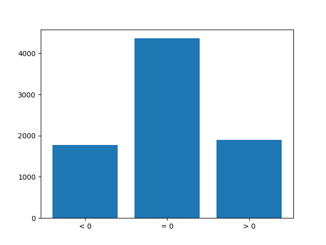

**Behavioral Cloning Project**

The goals / steps of this project are the following:
* Use the simulator to collect data of good driving behavior
* Build, a convolution neural network in Keras that predicts steering angles from images
* Train and validate the model with a training and validation set
* Test that the model successfully drives around track one without leaving the road
* Summarize the results with a written report


## Rubric Points
---
#### Required Files

##### Submission includes all required files and can be used to run the simulator in autonomous mode

My project includes the following files:
- [ ] [model.py](model.py)
- [ ] [drive.py](drive.py)
- [ ] [model.h5](model.h5)
- [ ] [writeup_report.md](writeup_report.md)


##### Submission includes functional code
Using the Udacity provided simulator and my drive.py file, the car can be driven autonomously around the track by executing 
```sh
python drive.py model.h5
```

##### Submission code is usable and readable
The model.py file contains the code for training and saving the convolution neural network under `model.h5` file.

---
#### Model Architecture and Training Strategy

##### An appropriate model architecture has been employed

My model consists of a convolution neural network which is based on the recommended NVidia Architecture (See below)

The model includes RELU layers to introduce nonlinearity 
````
model.add(Convolution2D(24,5,5,subsample=(2,2),activation="relu"))
model.add(Convolution2D(36,5,5,subsample=(2,2),activation="relu"))
model.add(Convolution2D(48,5,5,subsample=(2,2),activation="relu"))
model.add(Convolution2D(64,3,3,activation="relu"))
model.add(Convolution2D(64,3,3,activation="relu"))
````

and the data is normalized in the model using a Keras lambda layer
````
model.add(Lambda(lambda x: (x / 255.0) - 0.5, input_shape=(66,320,3)))
````

Used the recommended NVidia architecture with

| Layer         		|     Description	        					| 
|:---------------------:|:---------------------------------------------:| 
| Convolution layer  	| strides = 2x2, add a 5x5 convolution on top, with 24 output filters with *relu* activation | 
| Convolution layer  	| strides = 2x2, add a 5x5 convolution on top, with 36 output filters  with *relu* activation | 
| Convolution layer  	| strides = 2x2, add a 5x5 convolution on top, with 48 output filters with *relu* activation | 
| Convolution layer  | add a 3x3 convolution on top, with 64 output filters with *relu* activation | 
| Convolution layer  |  add a 3x3 convolution on top, with 64 output filters with *relu* activation | 
| Flatten | output = 100   |
| Fully connected		|  Input = 100. Output = 50.        									|
| Fully connected		|  Input = 50. Output = 10         									|
| Fully connected				| Input = 10. Output = 1.        									|


##### Attempts to reduce overfitting in the model

Tried to introduce dropouts at various intervals which did result in improved validation performance but the resulting driving patterns were not satisfactory. The car would veer off the  first corner.

##### Model parameter tuning

The model used an adam optimizer, which although generally used more computation power than other techniques like GradientDescentOptimizer but provides faster convergence with minimal interventions to modify to learning rate. [LINK](https://machinelearningmastery.com/adam-optimization-algorithm-for-deep-learning).

##### Appropriate training data

Training data was chosen to keep the vehicle driving on the road. I used the data provided in the assignment and augmented it with some image manipulation techniques to have a better distribution of data.

For details about how I created the training data, see the next section. 

---
#### Model Architecture and Training Strategy

##### Solution Design Approach

My first step was to use a convolution neural network model similar to the NVidia architecture which was one of the standards out there as mentioned in this publication - https://devblogs.nvidia.com/parallelforall/deep-learning-self-driving-cars/

In order to gauge how well the model was working, I split my image and steering angle data into a training and validation set. The data was augmented (see training section below around augmentation strategy)

This data was shuffled and cropped fed to the CNN classifier. Cropping was done as a preliminary step of the CNN architecture

````
model.add(Cropping2D(cropping=((70,25), (0,0)), input_shape=(160, 320, 3)))
````

I ran some experiments by modifying the parameters for training set i.e. including left right image, introducing corrections to steering angles of left and right image, trying out some drop outs, augmenting images

| Parameters | Output | Chart |
|:---------------------:|:---------------------------------------------:|:---------------------:|
| include_left_right = False, <br> augmented_images = True, <br> dropout=True | In 1087s <br> loss: 0.0139 <br>  val_loss: 0.0115 |  | 
| include_left_right = True, <br> augmented_images = True, <br> dropout=False | In 888s <br>  loss: 0.0129 <br>  val_loss: 0.0126 |  | 
| include_left_right = False,<br> augmented_images = True,<br> dropout=False | In 927s <br>  loss: 0.0091 <br>  val_loss: 0.0097 |  | 


Based on above values I chose to just augment the images and not include left, right images and no dropouts since the validation error was close to training error

##### Final Model Architecture

The final model architecture  consisted of a convolution neural network with the following layers and layer sizes 

| Layer         		|     Description	        					| 
|:---------------------:|:---------------------------------------------:| 
| Convolution layer  	| strides = 2x2, add a 5x5 convolution on top, with 24 output filters with *relu* activation | 
| Convolution layer  	| strides = 2x2, add a 5x5 convolution on top, with 36 output filters  with *relu* activation | 
| Convolution layer  	| strides = 2x2, add a 5x5 convolution on top, with 48 output filters with *relu* activation | 
| Convolution layer  | add a 3x3 convolution on top, with 64 output filters with *relu* activation | 
| Convolution layer  |  add a 3x3 convolution on top, with 64 output filters with *relu* activation | 
| Flatten | output = 100   |
| Fully connected		|  Input = 100. Output = 50.        									|
| Fully connected		|  Input = 50. Output = 10         									|
| Fully connected				| Input = 10. Output = 1.        									|

Here is a visualization of the architecture from the NVidia publication


##### Creation of the Training Set & Training Process


I did some data exploration based on distribution of steering angles. As expected - there was twice more straight steering images than left or right steering images.



To rectify the distribution, I augmented the left and right steering images by changing the contrast and brightness

````
def augment(filename):
	name = DATA_ROOT + '/IMG/'+filename.split('/')[-1]
	bgr_image = cv2.imread(name)
	alpha = 1+0.1*np.random.randint(1,5,size=1) #for contrast
	beta = 1.*np.random.randint(10,30,size=1)  # for brightness
	bgr_image = cv2.add(cv2.multiply(bgr_image,alpha), beta)
	image = cv2.cvtColor(bgr_image, cv2.COLOR_BGR2RGB)
	return image
````

To increase the data set further, I reveresed the original and augmented image

````
images.extend([center_image, np.fliplr(center_image)])
angles.extend([center_angle, -center_angle])
...
images.extend([augmented_image, np.fliplr(augmented_image)])
angles.extend([center_angle, -center_angle])
````

---
#### Simulation
Attaching the video [video](./output_videos/track1.mp4)
